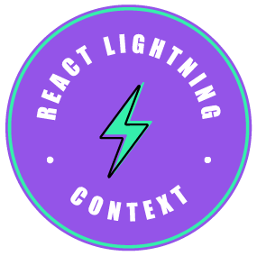

# react-lightning-context

> This is a performant and simple react context.

A super performant lightning fast context library that only re-renders what has changed and nothing else. This library is a drop in replacement of the official `React Context`.

[GitHub](https://github.com/guiyep/react-lightning-context)
[Getting Started](#react-lightning-context)
